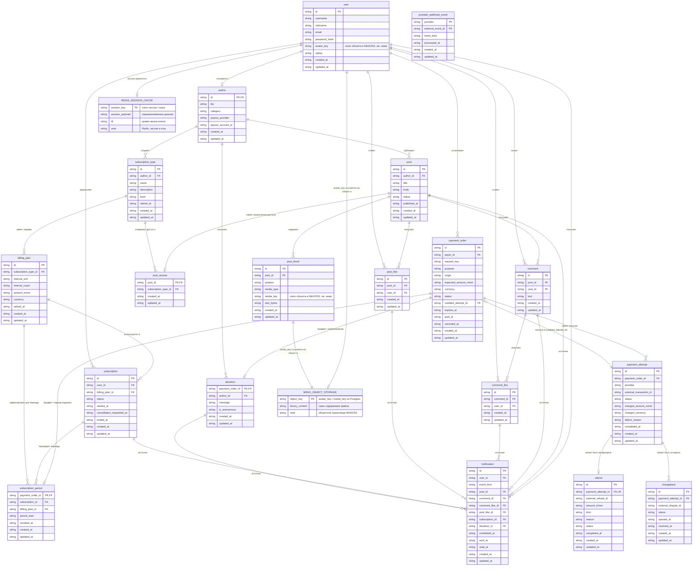

# ER-диаграмма

Redis и MinIO/S3 не являются реляционными таблицами, поэтому показаны как
отдельные небиблиотечные блоки с пояснением через атрибут `note`

```mermaid
erDiagram
    user {
        string id PK
        string username
        string nickname
        string email
        string password_hash
        string avatar_key "ключ объекта в MinIO/S3, см. ниже"
        string status
        string created_at
        string updated_at
    }

    author {
        string id PK, FK
        string bio
        string category
        string payout_provider
        string payout_account_id
        string created_at
        string updated_at
    }

    subscription_type {
        string id PK
        string author_id FK
        string name
        string description
        string level
        string retired_at
        string created_at
        string updated_at
    }

    billing_plan {
        string id PK
        string subscription_type_id FK
        string interval_unit
        string interval_count
        string amount_minor
        string currency
        string retired_at
        string created_at
        string updated_at
    }

    subscription {
        string id PK
        string user_id FK
        string billing_plan_id FK
        string status
        string started_at
        string cancellation_requested_at
        string ended_at
        string created_at
        string updated_at
    }

    payment_order {
        string id PK
        string payer_id FK
        string request_key
        string purpose
        string origin
        string expected_amount_minor
        string currency
        string status
        string credited_attempt_id FK
        string expires_at
        string paid_at
        string canceled_at
        string created_at
        string updated_at
    }

    payment_attempt {
        string id PK
        string payment_order_id FK
        string provider
        string external_transaction_id
        string status
        string charged_amount_minor
        string charged_currency
        string failure_reason
        string completed_at
        string created_at
        string updated_at
    }

    provider_webhook_event {
        string provider PK
        string external_event_id PK
        string event_kind
        string processed_at
        string created_at
        string updated_at
    }

    refund {
        string id PK
        string payment_attempt_id FK, UK
        string external_refund_id
        string amount_minor
        string kind
        string reason
        string status
        string completed_at
        string created_at
        string updated_at
    }

    chargeback {
        string id PK
        string payment_attempt_id FK
        string external_dispute_id
        string status
        string opened_at
        string resolved_at
        string created_at
        string updated_at
    }

    donation {
        string payment_order_id PK, FK
        string author_id FK
        string message
        string is_anonymous
        string created_at
        string updated_at
    }

    subscription_period {
        string payment_order_id PK, FK
        string subscription_id FK
        string billing_plan_id FK
        string period_start
        string revoked_at
        string created_at
        string updated_at
    }

    post {
        string id PK
        string author_id FK
        string title
        string body
        string status
        string published_at
        string created_at
        string updated_at
    }

    post_access {
        string post_id PK, FK
        string subscription_type_id FK
        string created_at
        string updated_at
    }

    post_block {
        string id PK
        string post_id FK
        string position
        string media_type
        string media_key "ключ объекта в MinIO/S3, см. ниже"
        string size_bytes
        string created_at
        string updated_at
    }

    post_like {
        string id PK
        string post_id FK
        string user_id FK
        string created_at
        string updated_at
    }

    comment {
        string id PK
        string post_id FK
        string user_id FK
        string text
        string created_at
        string updated_at
    }

    comment_like {
        string id PK
        string comment_id FK
        string user_id FK
        string created_at
        string updated_at
    }

    notification {
        string id PK
        string user_id FK
        string event_kind
        string post_id FK
        string comment_id FK
        string comment_like_id FK
        string post_like_id FK
        string subscription_id FK
        string donation_id FK
        string scheduled_at
        string sent_at
        string read_at
        string created_at
        string updated_at
    }

    MINIO_OBJECT_STORAGE {
        string object_key PK "avatar_key / media_key из Postgres"
        string binary_content "само содержимое файла"
        string note "объектное хранилище MinIO/S3"
    }

    REDIS_SESSION_CACHE {
        string session_key PK "ключ сессии / кэша"
        string session_payload "сериализованные данные"
        string ttl "время жизни ключа"
        string note "Redis, сессии и кэш"
    }

    user ||--o| author : "становится"
    author ||--o{ subscription_type : "создаёт"
    subscription_type ||--o{ billing_plan : "имеет тарифы"
    billing_plan ||--o{ subscription : "используется в"
    user ||--o{ subscription : "оформляет"
    user ||--o{ payment_order : "оплачивает"
    payment_order ||--o{ payment_attempt : "имеет попытки"
    payment_attempt ||--o| payment_order : "зачтена в (credited_attempt_id)"
    payment_order ||--o| donation : "предмет: пожертвование"
    payment_order ||--o| subscription_period : "предмет: период подписки"
    author ||--o{ donation : "получает"
    subscription ||--o{ subscription_period : "порождает периоды"
    billing_plan ||--o{ subscription_period : "зафиксирован для периода"
    payment_attempt ||--o| refund : "может быть возвращена"
    payment_attempt ||--o{ chargeback : "может быть оспорена"
    author ||--o{ post : "публикует"
    post ||--o| post_access : "имеет ограничение доступа"
    subscription_type ||--o{ post_access : "открывает доступ к"
    post ||--o{ post_block : "содержит"
    post ||--o{ post_like : "получает"
    user ||--o{ post_like : "ставит"
    post ||--o{ comment : "получает"
    user ||--o{ comment : "пишет"
    comment ||--o{ comment_like : "получает"
    user ||--o{ comment_like : "ставит"
    user ||--o{ notification : "получает"
    post ||--o{ notification : "источник"
    comment ||--o{ notification : "источник"
    comment_like ||--o{ notification : "источник"
    post_like ||--o{ notification : "источник"
    subscription ||--o{ notification : "источник"
    donation ||--o{ notification : "источник"
    user ||--o| MINIO_OBJECT_STORAGE : "avatar_key ссылается на объект в"
    post_block ||--|| MINIO_OBJECT_STORAGE : "media_key ссылается на объект в"
    user ||--o| REDIS_SESSION_CACHE : "сессия хранится в"
```
